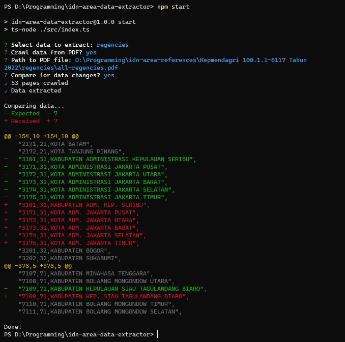

<h1><a href="https://github.com/fityannugroho/idn-area-data">idn-area-data</a> Extractor</h1>

Extract the Indonesia area data from [raw sources](https://github.com/fityannugroho/idn-area-data/docs/references.md) into CSV.



## Requirements

- Node.js v16 or later
- NPM or yarn

## How to use

1. Clone this repository.
1. Install dependencies.

   ```bash
   npm install
   ```

1. Start the program using this command:

   ```bash
    npm run start
    ```

## Provide the data manually

You can provide the data to be extracted manually by creating **`input.txt`** file inside the `dist` folder, and put the raw data in there. The extracted data will be available in **`dist/output.csv`** file.

The extractor uses regex to extract raw data based on the data type you selected in the prompt :

```bash
? Select data to extract (Use arrow keys)
❯ regencies
  districts
  villages
  islands
```

## Input-output example

Below is an example of the raw data expected by the extractor and the extracted data. The cleaner the raw data you provide, the better the results.

### Example for regencies data

**Input:**

```txt
KAB. ACEH SELATAN 18 4.175,3751 Luas Wilayah ... 11.01 234.1690 260  // Better, the name and code is in same row (KAB. ACEH SELATAN, 11.01)
KAB. ACEH TENGGARA 16 4.179,1232 Luas Wilayah ... 11.02 227.9210 385
KAB. ACEH TIMUR 24 5.409,4063 PP No. 5/2007 tentang Pemindahan ... // Retrieves the name first (KAB. ACEH TIMUR)
...
11.03 434.9290 513  // Then, search for the code data (11.03)
KAB. ACEH TENGAH 14 4.468,4174 Luas Wilayah ... 3 Oktober 2022.
11.04 219.7440 295
...
KOTA BANDA ACEH 9 56,77019 Luas Wilayah Definitif, ... Tanggal 3 Oktober 2022.
...
11.71 254.0240 90
KOTA SABANG 3 122,06320 Luas Wilayah Definitif, PGP sesuai ...
...
11.72 42.8670 18
```

**Output:**

```csv
code,province_code,name
1101,11,KABUPATEN ACEH SELATAN
1102,11,KABUPATEN ACEH TENGGARA
1103,11,KABUPATEN ACEH TIMUR
1104,11,KABUPATEN ACEH TENGAH
1171,11,KOTA BANDA ACEH
1172,11,KOTA SABANG
```

### Example for districts data

**Input:**

```txt
11.01.01 Bakongan 71
11.01.02 Kluet Utara 212
11.01.03 Kluet Selatan 173
11.01.04 Labuhanhaji 16 Perubahan nama Kec Labuhan Haji, sesuai ...
11.01.05 Meukek 235 ...
11.01.06 Samadua 286
...
11.01.09 Trumon 129
11.01.10 Pasi Raja 2110
```

**Output:**

```csv
code,regency_code,name
110101,1101,BAKONGAN
110102,1101,KLUET UTARA
110103,1101,KLUET SELATAN
110104,1101,LABUHAN HAJI
110105,1101,MEUKEK
110106,1101,SAMADUA
110109,1101,TRUMON
110110,1101,PASI RAJA
```

### Example for villages data

**Input:**

```txt
11.01.01.2001 1 Keude Bakongan
11.01.01.2002 2 Ujong Mangki Perbaikan nama sesuai ...
...
11.01.01.2003 3 Ujong Padang Perbaikan nama sesuai ...
11.01.01.2016 6 Padang Beurahan Pemekaran Desa, Qonun No. 6/2010 ...
...
11.01.01.2017 7 Gampong Baro Pemekaran Desa, Qonun No. 6/2010
11.01.02 2 Kluet Utara - 21
11.01.02.2001 1 Fajar Harapan
11.01.02.2002 2 Krueng Batee
```

**Output:**

```csv
code,district_code,name
1101012001,110101,KEUDE BAKONGAN
1101012002,110101,UJONG MANGKI
1101012003,110101,UJONG PADANG
1101012016,110101,PADANG BEURAHAN
1101012017,110101,GAMPONG BARO
1101022001,110102,FAJAR HARAPAN
1101022002,110102,KRUENG BATEE
```

### Example for islands data

**Input:**

```txt
KAB. ACEH SELATAN 611.01
11.01.40001 Pulau Batukapal 03°19'03.44" U 097°07'41.73" T TBP
11.01.40002 Pulau Batutunggal 03°24'55.00" U 097°04'21.00" T TBP
11.01.40003 Pulau Kayee 02°52'54.99" U 097°31'07.00" T ...
11.01.40004 Pulau Mangki 02°54'25.11" U 097°26'18.51" T
...
KAB. ACEH TIMUR 811.03
11.03.40001 Pulau Bangka Matee 04°36'48.74" U 098°00'31.21" T TBP
11.03.40002 Pulau Gosongsungaibelah 05°09'12.80" U 097°34'56.08" T TBP
11.03.40003 Pulau Krueng Beukah 04°36'19.18" U 098°01'02.04" T
11.03.40004 Pulau Kuala Parek 04°41'35.16" U 097°57'59.15" T
```

**Output:**

```csv
code,regency_code,coordinate,is_populated,is_outermost_small,name
110140001,1101,03°19'03.44" N 097°07'41.73" E,0,0,Pulau Batukapal
110140002,1101,03°24'55.00" N 097°04'21.00" E,0,0,Pulau Batutunggal
110140003,1101,02°52'54.99" N 097°31'07.00" E,0,0,Pulau Kayee
110140004,1101,02°54'25.11" N 097°26'18.51" E,0,0,Pulau Mangki
110340001,1103,04°36'48.74" N 098°00'31.21" E,0,0,Pulau Bangka Matee
110340002,1103,05°09'12.80" N 097°34'56.08" E,0,0,Pulau Gosongsungaibelah
110340003,1103,04°36'19.18" N 098°01'02.04" E,0,0,Pulau Krueng Beukah
110340004,1103,04°41'35.16" N 097°57'59.15" E,0,0,Pulau Kuala Parek
```

## Crawl the data from PDF

Instead of manually providing the data, you can use the crawler that automatically retrieves the text from the PDF pages and saves it in `input.txt` file.

You need to provide the path to the PDF file in the prompt :

```bash
? Crawl data from PDF? yes
? Path to the PDF file: path/to/file.pdf
```

> **Tips!**
>
> We recommend you to **break down the PDF pages** based on the data type to minimalize the incorrect data extraction. For example, we have broken down the [REF-2022-2](https://github.com/fityannugroho/idn-area-data/blob/main/docs/references.md#REF-2022-2) reference into separated files :
>
> | Data | PDF File |
> | --- | --- |
> | Regencies | [Link](https://drive.google.com/file/d/1B4EZjirbEePKZvAx4IfAH1BVi3ZjcAz-/view?usp=sharing) |
> | Districts | [Link](https://drive.google.com/file/d/15gWxAodtbTkpq9neawjh-xZ2hdsTC13k/view?usp=sharing) |
> | Islands | [Link](https://drive.google.com/file/d/1UdO92VMLNgVcq90mTJbuFEXgMzmMxhi3/view?usp=sharing) |

### Compare the extracted data

You can compare the extracted data with the latest data provided in [idn-area-data](https://github.com/fityannugroho/idn-area-data) package by answering "yes" to this following prompt :

```bash
? Compare for data changes? yes
```

The compared data will be shown in the prompt like git diff (see the [screenshot](docs/screenshot.png)).

> **Tips!**
>
> Only use this compare data if you provide **complete raw data** (all regencies/districts/islands/villages).
